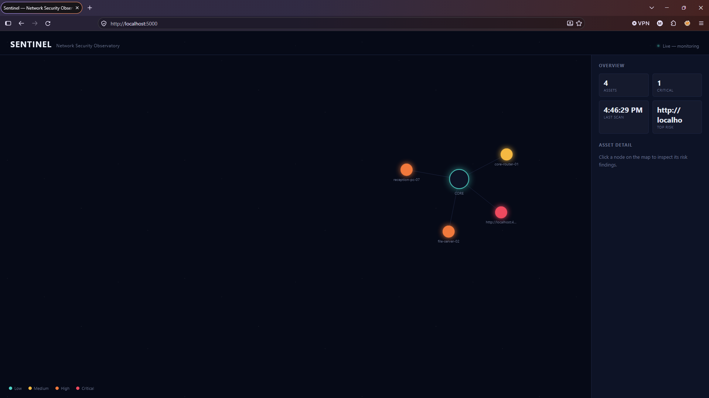
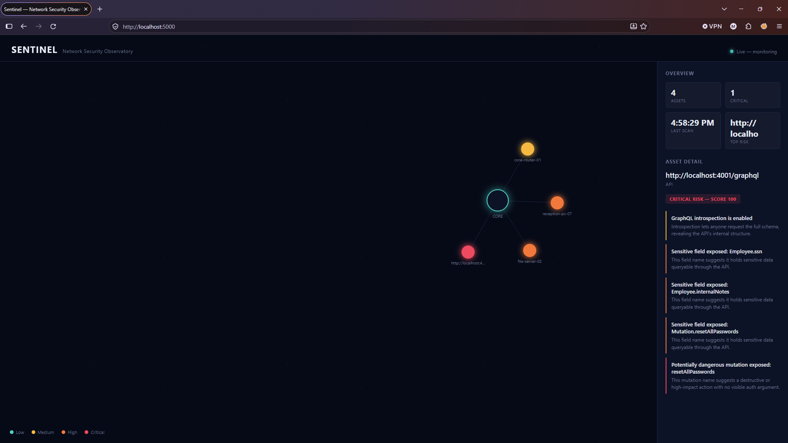

# Sentinel — Network Security Observatory

A real-time system that scans APIs and network devices, scores their security risk, and displays everything on a live "constellation map" dashboard.

Sentinel grew out of an IT Asset Management database prototype I built during my industrial attachment at Kenya Airports Authority (ICT Department, JKIA).

## Screenshots




## Features

- **API schema scanning**: uses GraphQL introspection to find risky patterns (exposed sensitive fields, dangerous mutations, introspection left enabled)
- **Risk scoring**: every asset gets a score from 0-100 and a severity level (low / medium / high / critical)
- **Live updates**: the dashboard re-scans every 20 seconds and pushes results to the browser over WebSocket, with no page refresh
- **Constellation map**: a D3.js force-directed graph where colour shows risk level and clicking a node shows exactly what was found and why
- **Scan history**: stored in SQLite so nothing is lost between runs
- **Security report**: one click produces a printable report with every finding and a plain-language fix (use the buttons on the dashboard, or open `/report`)

## Tech Stack

Node.js, Express, GraphQL, SQLite (Node's built-in `node:sqlite`), D3.js, WebSocket

## What's Inside

```
sentinel/
├── target-api/        Demo company GraphQL API (the "target" Sentinel scans)
│   └── server.js
├── scanner/           The scanning engine: introspection + risk analysis
│   └── scanner.js
├── db/                SQLite database layer
│   ├── schema.sql
│   └── db.js
├── dashboard/         Live dashboard (web server + frontend)
│   ├── server.js
│   └── public/index.html
├── report.js          Builds the security report (HTML, printable to PDF)
├── start.js           Starts the target API and dashboard together
└── package.json
```

## How It Works

1. **`target-api/server.js`**: a small GraphQL API standing in for a real company system. It deliberately includes common real-world mistakes: introspection left enabled, an exposed `ssn` field, and an unauthenticated `resetAllPasswords` mutation. This is what Sentinel scans.

2. **`scanner/scanner.js`**: the core engine. It:
   - Sends a standard GraphQL introspection query to the target, asking the API to describe its own schema (types, fields, mutations).
   - Analyses that schema for risky patterns (sensitive field names, dangerous mutations, introspection being exposed).
   - Runs a **simulated** network device discovery step (representing what a tool like `nmap` would find on a real subnet) and checks patch age and risky open ports. Device data is simulated in this version.
   - Writes every result to SQLite with a risk score and severity level.

3. **`db/`**: stores assets and their scan history. It uses the same relational design as the original IT Asset Management prototype, extended with a `scans` table for history.

4. **`dashboard/`**: a web server that re-scans automatically and pushes updates instantly to the browser over WebSocket. The frontend draws each asset as a node on a force-directed map.

5. **`report.js`**: turns the latest scan into a clean report with a summary, a table of assets, and a plain-language fix for every finding.

## Getting Started

**Requirements:** [Node.js](https://nodejs.org) v22.5 or newer (the built-in `node:sqlite` module needs it). Built and tested on v26.7.0 on Windows.

```bash
git clone <your-repo-url>
cd sentinel
npm install
```

Start everything with one command:
```bash
npm start
```

Or run the two parts separately in two terminals: `npm run start:target` and `npm run start:dashboard`.

Then open **http://localhost:5000** in your browser. Within a couple of seconds the map fills in. Click any node to see its findings. It re-scans every 20 seconds, so you can leave it running and watch it update.

To run a single scan and print the raw JSON:
```bash
npm run scan:once
```

## Security Report

Click **View report** or **Download report** at the top of the dashboard, or open `http://localhost:5000/report`. Use the **Print / Save as PDF** button on the report page to make a PDF.

You can put names on the report with the address, for example:
```
http://localhost:5000/report?for=Client%20Name&by=Your%20Name
```

## Known Limitations / Next Steps

- Device discovery is simulated; next step is real network discovery
- The graph sits off-centre and long URLs are cut off in the "Top risk" card
- Add more vulnerability rules and a one-click PDF export

## Responsible Use

Only scan systems you own or have written permission to test. The bundled target API is intentionally vulnerable and is for local demo use only. Do not expose it to the internet.

## Author

Adrian, Diploma in Computer Science, The Nairobi National Polytechnic (2026)

GitHub: [@cipher-mirage](https://github.com/cipher-mirage)